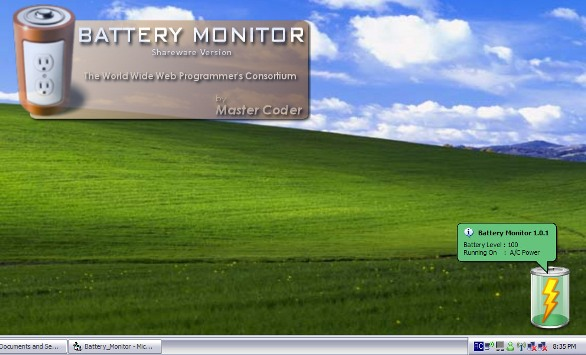



## Graphical Battery Monitor

### Description

Provides a graphical battery for the desktop that represents the current battery level. There is also a tray icon that shows the battery level and whether or not A/C power is available. Have a look, and give me a vote or comment if you find it usefull or the code helpful.
 
### More Info
 

             |
---                |---
**Submitted On**   |2008-02-11 20:45:52
**By**             |[Master\_Coder](https://github.com/Planet-Source-Code/PSCIndex/blob/master/ByAuthor/master-coder.md)
**Level**          |Intermediate
**User Rating**    |5.0 (10 globes from 2 users)
**Compatibility**  |VB 6\.0
**Category**       |[Complete Applications](https://github.com/Planet-Source-Code/PSCIndex/blob/master/ByCategory/complete-applications__1-27.md)
**World**          |[Visual Basic](https://github.com/Planet-Source-Code/PSCIndex/blob/master/ByWorld/visual-basic.md)
**Archive File**   |[Graphical\_2101472112008\.zip](https://github.com/Planet-Source-Code/master-coder-graphical-battery-monitor__1-70081/archive/master.zip)

### API Declarations

Too many to list. See the code.

